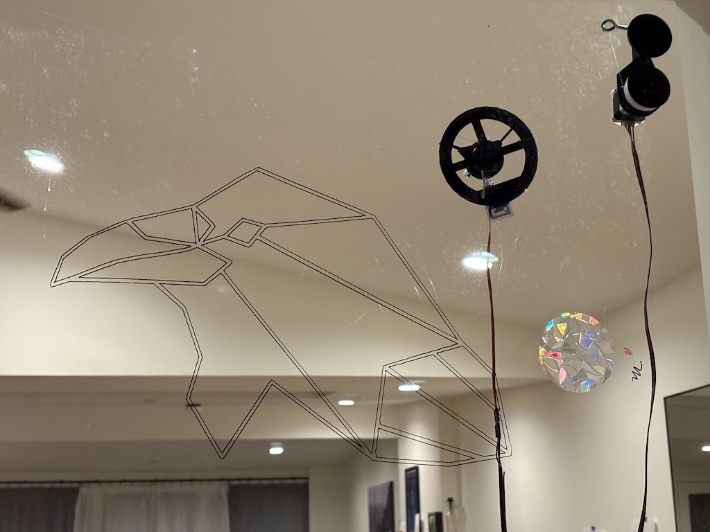
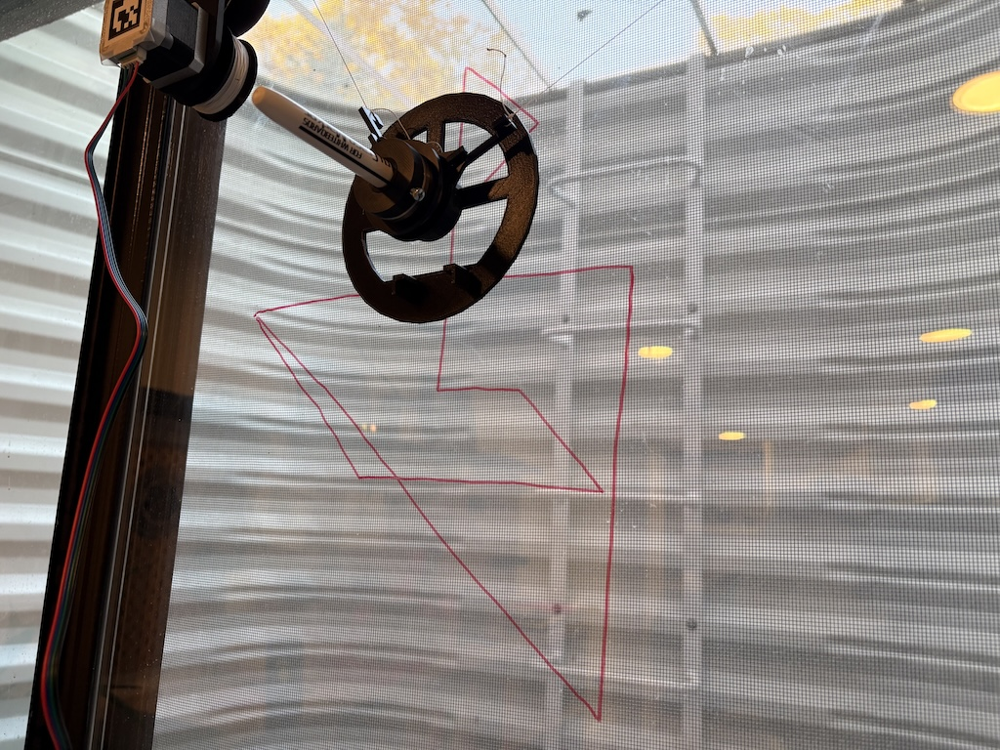
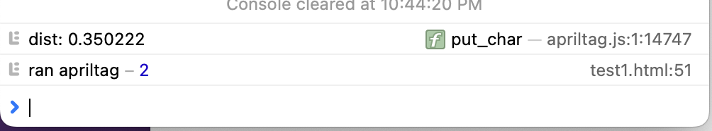
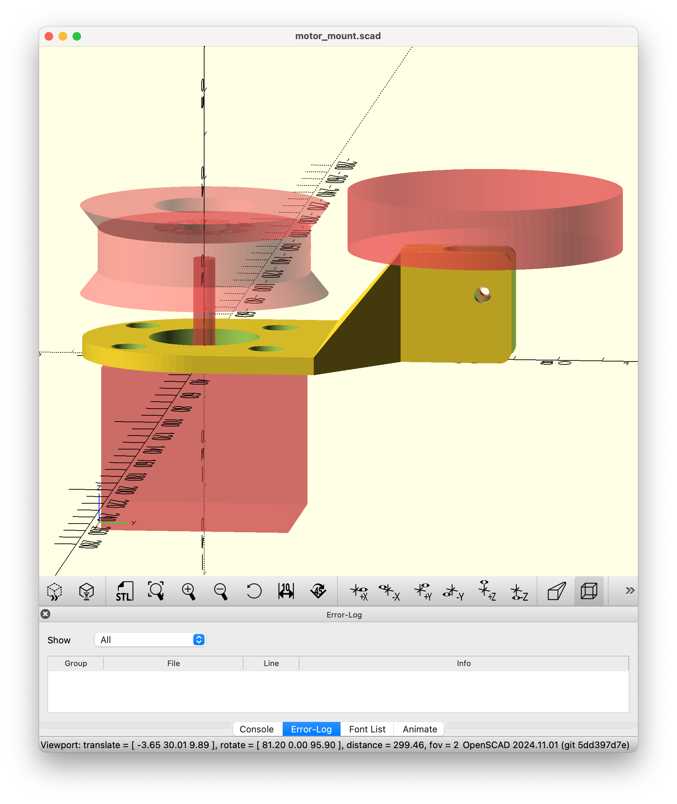
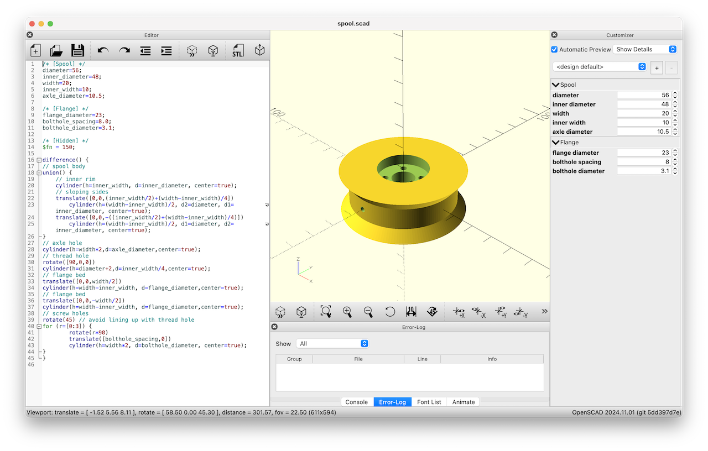
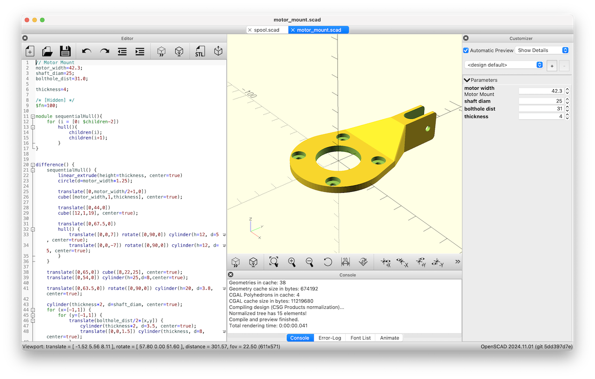
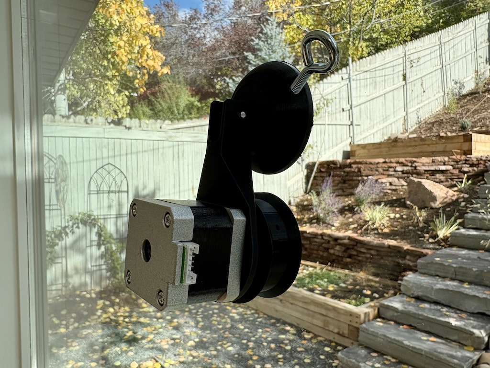

# Project Journal

# 2024-11-14

The new motor controllers are here, soldered, and wired up. After a couple practice runs, I figured out how to fabricate the motor cables I needed, as well. It took a few attempts for me to get the JST PH connectors tight, they're tricky.

We tested out a custom .svg on one of our larger windows. I am very happy with the precision, I wasn't sure I'd be able to get closely spaced lines to be so crisp.

# 2024-11-12

I needed to fabricate some longer 3 meter cables for the stepper motors. My first attempt did not end well, one of the cables ended up shorting out and frying both motor controllers. Fortunately nothing else seems broken. But I'm going to have to wait a couple days for replacement parts.

## 2024-11-11

Drawing a triforce!

This is a hard-coded list of points. Next steps:

* Parse SVG to draw commands.
* Allow scaling and translation of the SVG commands to fit the desired space.
* Lifting the pen. I'm waiting on some hardware parts for this one.

The apriltag calibration setup works pretty well, but my y distance calculation is a little bit off somewhere. Safari on iOS makes the UX a little rough, sadly. If you take a photo directly in the browser, it doesn't include the EXIF data. So you have to take a photo in the photos app, then switch over to the browser and upload it. 😮‍💨

## 2024-11-08

I got a chance to brush off my rusty trig skills and figured out how to map moving between (x,y) coordinates into rotations of the two motors.

Then I started in on the actual web UI. The backend is written in Go. I plan to keep most of the smarts in the browser, the backend will just execute simple draw commands and persist state to disk. I got enough done on that today to enable manual etch-a-sketch style drawing.

## 2024-11-08

I went down a rabbit hole of using AprilTags to automatically calibrate the robot with the positions of the motors and pen. I have a proof-of-concept compiling the [apriltag C library](https://github.com/AprilRobotics/apriltag) to WebAssembly so that the whole process can happen client-side in the browser UI. It was difficult working out how to get the camera focal length in pixels using just EXIF data, but I have something that is working well at least for iPhone cameras.

I put an apriltag on each motor, placed them 350cm apart, and I get a very accurate reading from a photo taken right in the browser:

## 2024-11-07

The robot is fully printed and moving! This is just a simple [python test script](motor-test.py). Now it's time to start on the actual drawing software. I realized I need some thinner dry-erase markers, I'm having trouble finding that locally so I have some arriving today or tomorrow.

I had to order another pair of motor driver boards, one of the pair I received was broken. I've also ordered the tools and parts I need to make longer stepper motor cables, they need to be at least 3 meters long to draw on the windows I'm planning to use this on.

I modified the motor mount so that the spool no longer rubs against the wall/window as the bot is running. It is a huge win to pull in all the connecting components as "ghosts" in the OpenSCAD model, so you can preview exactly how everything will fit together.

## 2024-11-04

The exact suction cups used in the original drawbot are no longer available. I found some similar ones online, but I have to modify the motor mount piece to allow for the slightly shorter suction cup stem.

Rather than stripping USB cables to wire up the motors, I'm going to try using some extra ethernet cable that I have lying around. I think it should be able to handle the current.

I have a raspberry pi 2 that was retired from another project, I'm going to use that rather than the pi zero.

The NEMA 17 motors I already have on hand look very similar on the spec sheets, I'm going to try using them.

New [spool](models/spool.scad) and [motor mount](models/motor_mount.scad) designs.

Testing the mount on a window:

