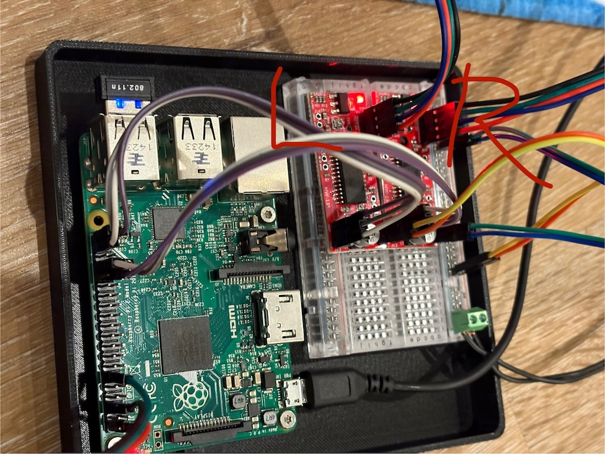
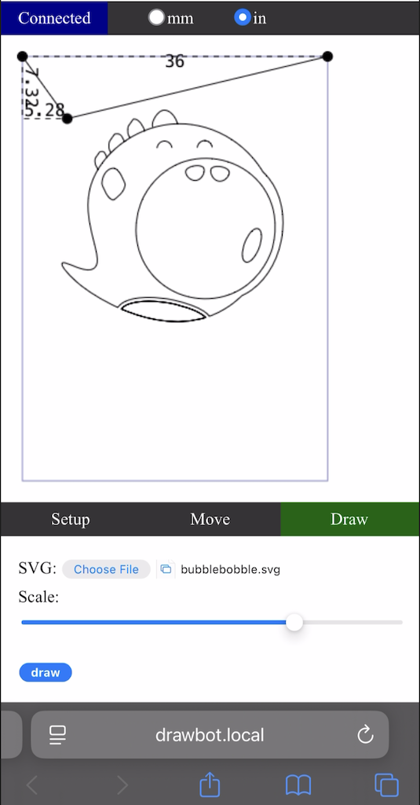
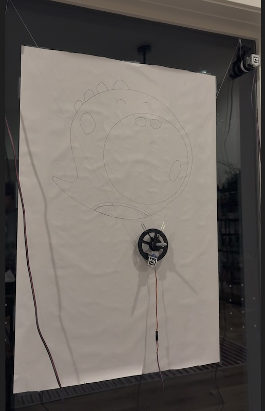

# Drawbot Remix

For [Recurse F2'24](https://www.recurse.com).

My goal is to build a wall-drawing robot, specifically to draw on our windows with dry-erase markers. This is starting out as a remix of [this drawbot project](https://github.com/andywise/drawbot) with some inspiration from [this other project](https://tinkerlog.com/2011/09/02/der-kritzler/).

I'm using some hardware I already have on hand, and I'm otherwise buying some different hardware from what was used in the original drawbot project, so the project will necessarily branch from the original drawbot project.

I've ended up making my own models for some of the 3D printed parts to match my needs. Those can be found in the [models](models/) folder in parameterized [OpenSCAD](https://openscad.org/) format.

I also ended up writing all my own software for the project, rather than using any of the software from the original drawbot. Just for fun!

## Progress

I'm keeping a journal in a [separate document](JOURNAL.md).

## Links

- [Drawbot on GitHub](https://github.com/andywise/drawbot)
- [Drawbot assembly details](https://www.instructables.com/Drawbot/)
- [OpenSCAD Cheat Sheet](https://openscad.org/cheatsheet/)
- [NEMA-17 motor dimensions](https://reprap.org/wiki/NEMA_17_Stepper_motor)
- [Hull operations](https://hackaday.com/2018/02/13/openscad-tieing-it-together-with-hull/) for OpenSCAD modeling
