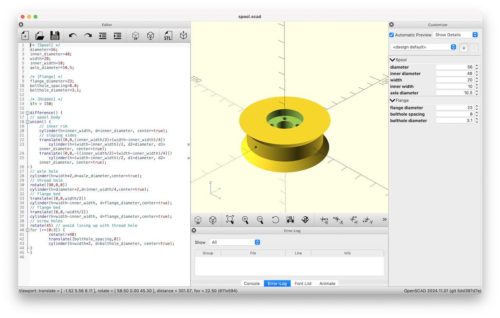
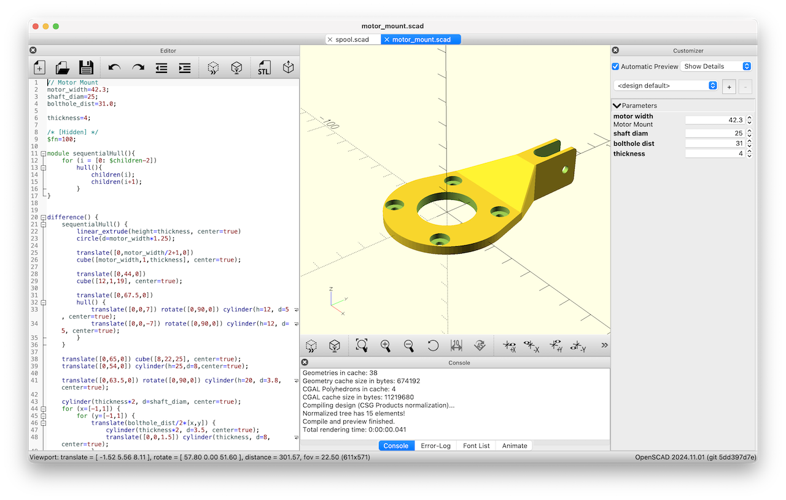

# Drawbot Remix

For [Recurse F2'24](https://www.recurse.com).

My goal is to build a wall-drawing robot, specifically to draw on our windows with dry-erase markers. This is starting out as a remix of [this drawbot project](https://github.com/andywise/drawbot) with some inspiration from [this other project](https://tinkerlog.com/2011/09/02/der-kritzler/).

I'm using some hardware I already have on hand, and I'm otherwise buying some different hardware from what was used in the original drawbot project, so the project will necessarily branch from the original drawbot project.

I've ended up making my own models for some of the 3D printed parts to match my needs. Those can be found in the [models](models/) folder in parameterized [OpenSCAD](https://openscad.org/) format.

## Progress

### 2024-11-07

The robot is fully printed and moving! This is just a simple [python test script](motor-test.py). Now it's time to start on the actual drawing software. I realized I need some thinner dry-erase markers, I'm having trouble finding that locally so I have some arriving today or tomorrow.

I had to order another pair of motor driver boards, one of the pair I received was broken. I've also ordered the tools and parts I need to make longer stepper motor cables, they need to be at least 3 meters long to draw on the windows I'm planning to use this on.

### 2024-11-04

The exact suction cups used in the original drawbot are no longer available. I found some similar ones online, but I have to modify the motor mount piece to allow for the slightly shorter suction cup stem.

Rather than stripping USB cables to wire up the motors, I'm going to try using some extra ethernet cable that I have lying around. I think it should be able to handle the current.

I have a raspberry pi 2 that was retired from another project, I'm going to use that rather than the pi zero.

The NEMA 17 motors I already have on hand look very similar on the spec sheets, I'm going to try using them.

New [spool](models/spool.scad) and [motor mount](models/motor_mount.scad) designs.

Testing the mount on a window:

## Links

- [Drawbot on GitHub](https://github.com/andywise/drawbot)
- [Drawbot assembly details](https://www.instructables.com/Drawbot/)
- [OpenSCAD Cheat Sheet](https://openscad.org/cheatsheet/)
- [NEMA-17 motor dimensions](https://reprap.org/wiki/NEMA_17_Stepper_motor)
- [Hull operations](https://hackaday.com/2018/02/13/openscad-tieing-it-together-with-hull/) for OpenSCAD modeling
- [imperial screw sizes](https://www.mcmaster.com/info/how-to-measure-screw-thread-size.html) reference
